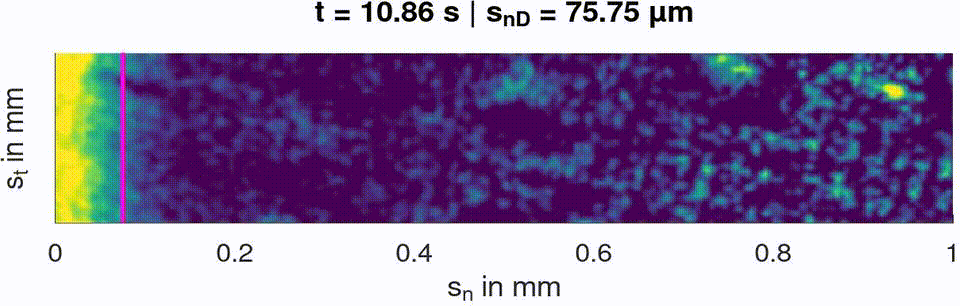

# SPIV-PLIF

Scripts and functions utilized to analyze a variety of fluid dynamic and mass transfer experiments as part of my PhD project. The measurements are performed with a setup combining SPIV (Stereo Particle Image Velocimetry) and PLIF (Planar Light Induced Fluorescence) for the investigation of velocity and concentration distribution in liquid films over flat and non-flat plates.

---
## Diffusivity

- [main processing script](processing/p_2d_diff.m)

- [main anaylsis script](analysis/a_diff/a_diff_main.m)

### Section of measured dissolved oxygen normalized concentration field highlighting the diffusion front:
 
Glycerol - Water ( 58.1 %wt - 41.9 %wt ) :

Propylene Glycol - Water ( 72.5 %wt: 27.5 %wt ) :

(with $s_n$ the coordinate normal to the gas-liquid interface)

---

## Film Flow Over Structures

### Flat Plate

- [main processing script](processing/p_2d_avg_uIc1.m)

- [main anaylsis script](analysis/a_flat/a_flat_main.m)

---

## Last Tested

Octave 8.2.0 (x86_64, Linux 6.4.1-arch2-1)

## License

BSD 3-clause, see [license](LICENSE.md).