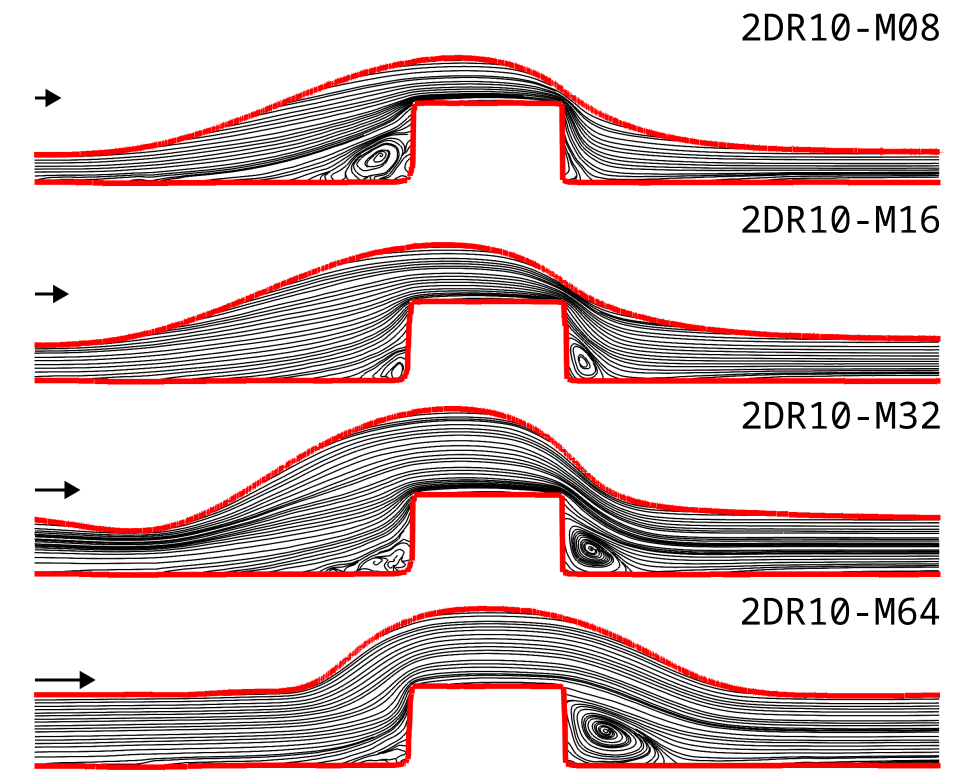

# SPIV-PLIF

Scripts and functions utilized to analyze a variety of fluid dynamic and mass transfer experiments as part of my PhD project. The measurements are performed with a setup combining SPIV (Stereo Particle Image Velocimetry) and PLIF (Planar Light Induced Fluorescence) for the investigation of velocity and concentration distribution in liquid films over flat and non-flat plates.

---

## Diffusivity Cuvette

- [main processing script](processing/p_2d_diff.m)

- [main anaylsis script](analysis/a_diff/a_diff_main.m)

### Section of measured dissolved oxygen normalized concentration field highlighting the diffusion front

Glycerol - Water ( 58.1 %wt - 41.9 %wt ) :

Propylene Glycol - Water ( 72.5 %wt: 27.5 %wt ) :

(with $s_n$ the coordinate normal to the gas-liquid interface)

### Publication

S. J. Gerke, G. Brösigke, and J.-U. Repke, “Planar light induced fluorescence quenching oxygen diffusivity measurement near the gas–liquid interface in aqueous glycerol and aqueous propylene glycol,” Experimental Thermal and Fluid Science, vol. 153, no. 111131, Apr. 2024, [doi: 10.1016/j.expthermflusci.2023.111131](https://doi.org/10.1016/j.expthermflusci.2023.111131).

---

## Film Flow Over Structures

### Flat Plate

- [Overview script flat](analysis/a_flat/a_flat.m)

### Rectangular Bump

- [Overview script 2DR10](analysis/a_2DR10/a_2DR10.m)

---

## Lastest Use

Octave 9.3.0 (x86_64, Linux 6.12.7-arch1-1)

## License

BSD 3-clause, see [license](LICENSE.md).
